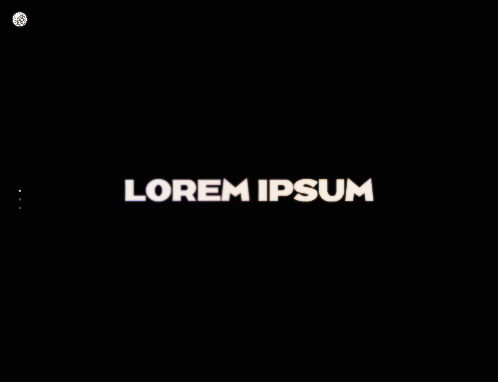
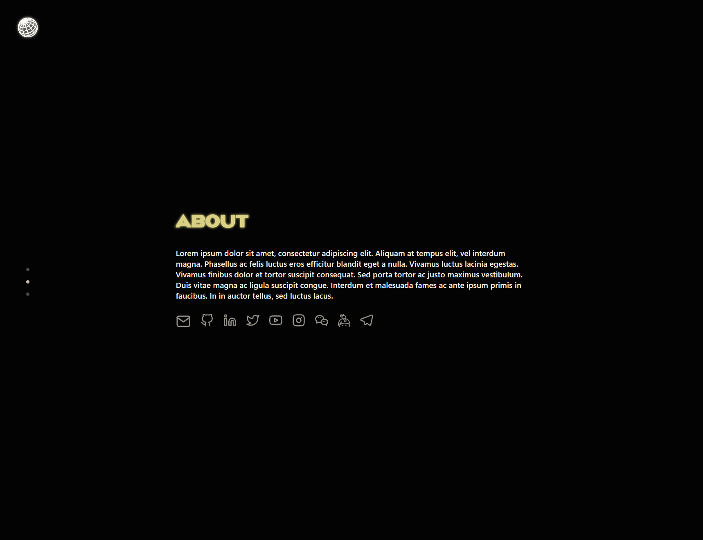
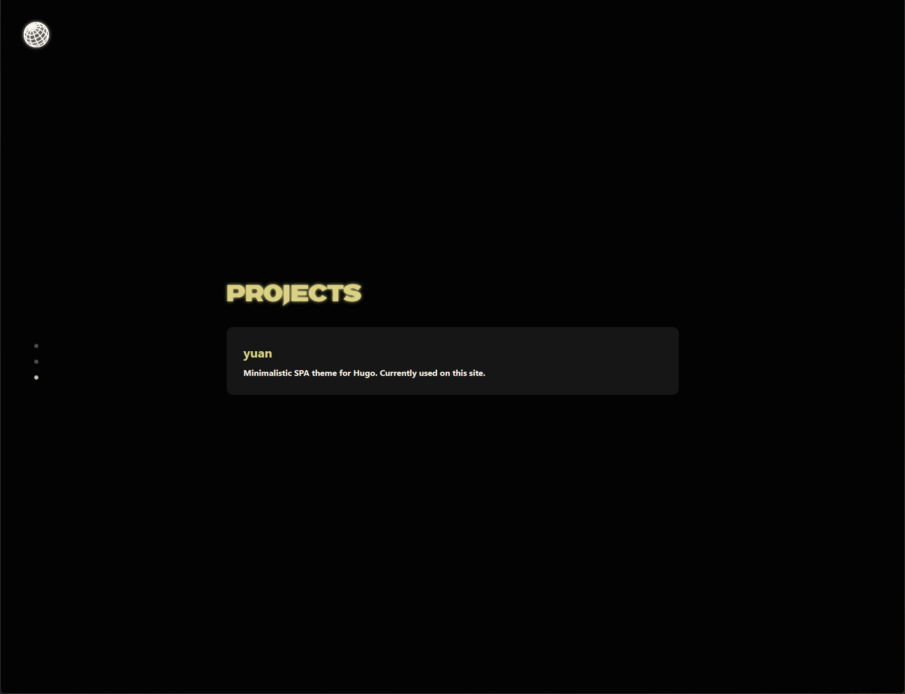

## Minimalistic SPA theme for Hugo

The theme I use on [golfed.xyz](https://golfed.xyz). I wasn't able to find a good middle-ground theme that'd be visually pleasing, but still have a minimalistic structure, so I decided to create a theme of my own. The theme is built around three main sections: landing/title, about, and projects. It's perfect for links to other social platforms, a short description about yourself, and a handful of your personal projects in a single-page form.

## Screenshots

| Home | About | Projects |
| :-: | :-: | :-: |
|  |  |  |

## Performance

- [Yellow Lab Tools front-end performance analysis](https://yellowlab.tools/result/gp7ykoa52o)

## Usage

The easiest way to install the theme is to use git submodules:

```shell
$ git submodule add --depth=1 https://github.com/17ms/yuan.git themes/yuan
# Required when recloning the repository (e.g. during automated deployment)
$ git submodule update --init --recursive
```

Use the `hugo.yaml` template below to configure the theme:

```yaml
# Note that due to performance reasons the custom webfont used in the site's
# titles is stripped to only contain unicode range U+0000-007F

baseURL: https://example.com/
title: Example
author: Example Author
language: en-GB
paginate: 10

theme: yuan

params:
  description: Example description

  # Mouse tracking animation
  enableMouseTracker: false

  # Trunaction limit of summaries inside projects display containers
  truncationLimit: 150

  # Logos, favicons and theme colors
  assets:
    favicon: "favicon.ico"
    favicon16: "favicon-16x16.png"
    favicon32: "favicon-32x32.png"
    appleTouchIcon: "apple-touch-icon.png"
    safariPinnedTabIcon: "safari-pinned-tab.svg"
    safariPinnedTabColor: "#5bbad5"
    manifest: "manifest.json"
    msTileColor: "#2b5797"
    msTileIcon: "mstile-150x150.png"
    themeColor: "#040404"
    logo: "logo.svg"

  # Icons shown below the about text snippet
  # List of the available icons can be found in the /layouts/partials/svg.html file
  socialIcons:
    - name: email
      url: "mailto:example@example.com"
      display: Optional name shown in tooltips, defaults to capitalized name

  # List of displayed items (e.g. software projects)
  itemDisplays:
    - name: Example project
      url: "#"
      description: Project description example
```
